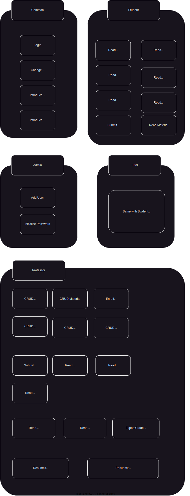

# KOJ Overview

## KOJ Introduction

KOJ is KNU Online Judge
KOJ provide online judge system for academic lecture

## KOJ Goal

- provide student grade management/analytics platform for professor
- provide adaptive feedback platform for student
- provide log data analytics platform for researcher

## KOJ Role



## KOJ Architecture



## KOJ ER Diagram


## KOJ UI Flow Diagram

**comming soon**

## KOJ Feature Diagram



## KOJ File Controll Structure

- /media/file/(file id).(its extention) : original file

- /koj/submission/(submission id) : copied files for submission

  - code : code text file
  - executable file : if compile language, executatble object file

- /koj/testcase/(testcase id) : copied files for testcase

  - input/(input filename)
  - output/(output filename)
  - koj_stdin.txt
  - koj_stdout.txt

- /data : backup for restarting docker containers

## KOJ Directory Structure

```
KOJ
├─back
│  ├─api
│  ├─controller
│  ├─lib
│  ├─logs
│  │  └─error
│  ├─middleware
│  ├─model
├─data
│  ├─file
│  ├─submission
│  └─testcase
├─front
│  ├─public
│  └─src
│      ├─Assets
│      │  ├─images
│      │  └─styles
│      ├─Components
│      │  ├─Button
│      │  └─Modal
│      ├─Layouts
│      │  ├─Footer
│      │  ├─Header
│      │  └─Sidebar
│      ├─Middleware
│      ├─Pages
│      │  ├─About
│      │  ├─Admin
│      │  ├─Code
│      │  ├─CreateUser
│      │  ├─DashScore
│      │  ├─DashScores
│      │  ├─Enrollment
│      │  ├─Home
│      │  ├─InitPassword
│      │  ├─Lab
│      │  ├─Lecture
│      │  ├─Lectures
│      │  ├─Login
│      │  ├─Material
│      │  ├─Materials
│      │  ├─Score
│      │  └─Scores
│      ├─Routes
│      ├─States
│      └─Utils
├─img
├─key
├─koj
│  ├─model
│  ├─submission
│  └─testcase
├─media
│  ├─file
│  ├─model
├─mongo1
├─mongo2
└─mongo3
```

## Endpoint Reference

[API Documentation](API.md)

# Getting Started

## KOJ Environment

KOJ does not have to worry any environment or dependency issue.

KOJ is designed to run an independent Docker environement. Docker provides a containerization platform that ensures consistency and eliminates dependency issues across differenet OS.

## Before Starting KOJ

0. check if installing docker

1. check if setting config files

- back/config.js : export id, pwd, dbName, port, KOJ_URL
- back/secret.js : export secret
- front/.env : PORT, HOST
- front/src/config.js : export BASE_URL, FILE_URL, CODE_URL, DOWNLOAD_URL, MEDIA_URL
- koj/config.js : module.exports id, pwd, dbName, ip, port, KOJ_URL

2. make key file

```bash
# in window, this step shoud be executed in docker container based linux
cd key
openssl -base64 756 > mongodb.key
chmod 400 mongodb.key
chown 999:999 mongodb.key
```

3. open ports : 3011~3015

```bash
sudo ufw allow 3011:3015/tcp
```

4. create user and initialize in mongo

```bash
docker compose up -d # for setting mongo
docker exec -it <mongo container id> bash
mongosh --port <mongo port>
use admin
db.createUser(
  {
    user: "yourRootId",
    pwd: "yourRootPwd",
    roles: [ { role: "root", db: "admin" } ]
  }
)
db.auth("yourRootId","yourRootPwd")
db.createUser(
  {
    user: "yourUserId",
    pwd: "yourUserPwd",
    roles: [ {role:"readWrite",db:"yourDB"} ]
  }
)
res.stepDown() # execute on primary node if error about not setting primary
db.getMongo().setReadPref('secondary') # execute each mongodb node
docker compose down # require restarting for applying options
```

## How to Start KOJ

0. check above "Before starting KOJ"

1. build docker images with shell script included docker build and Dockerfile

```bash
bash build.sh
```

2. start running containers with docker compose

```bash
docker compose up -d
```

if window, use docker-compose
